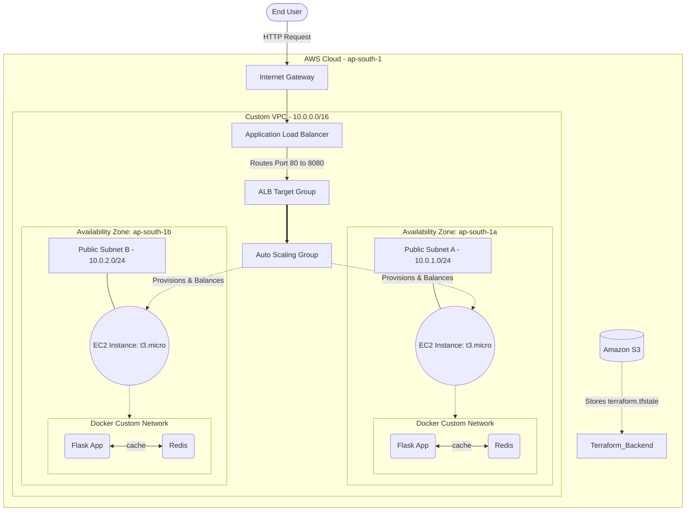

# ☁️ AWS Highly Available Infrastructure: Network Health Monitor

An Infrastructure as Code (IaC) project built with Terraform to deploy a highly available, fault-tolerant cloud architecture on AWS. This project provisions a custom virtual network and deploys the containerized [Network Node Health Monitor](https://github.com/thamizhanbu-k/network-health-monitor) behind an Application Load Balancer with automated EC2 scaling.

## 🏗️ System Architecture



## 📋 Prerequisites
* Terraform (v1.0+)
* AWS CLI configured with administrator or highly privileged IAM credentials.
* An active AWS account (Free Tier eligible, utilizing `t3.micro` instances).
* An S3 bucket created for Terraform remote state storage.

## 💻 Tech Stack
* **Infrastructure as Code:** Terraform (HCL)
* **Cloud Provider:** Amazon Web Services (AWS)
* **Compute:** EC2, Auto Scaling Groups (ASG), Launch Templates
* **Networking:** VPC, Subnets, Internet Gateways, Route Tables, Application Load Balancer (ALB)
* **Security:** AWS IAM (Roles/Instance Profiles), Security Groups
* **Bootstrapping:** Bash (`userdata.sh`), Docker Engine

## 🌐 AWS Resources Provisioned

| Resource Category | Components Handled |
|-------------------|--------------------|
| **Networking** | Custom VPC, multi-AZ Public Subnets, IGW, custom Route Tables. |
| **Load Balancing** | Internet-facing ALB with Target Groups and Health Checks. |
| **Compute Scaling** | Launch Templates specifying AMIs and Auto Scaling Groups (Desired Capacity = 1, dynamically balanced across AZs). |
| **Security** | "Defense in Depth" Security Groups (ALB allows `0.0.0.0/0` on port 80; EC2 only accepts traffic from ALB Security Group on port 8080). |
| **State Management** | Remote `s3` backend to securely store the `terraform.tfstate` file. |

## 🔄 Automated Bootstrap Workflow

This project utilizes a zero-touch provisioning strategy. When the Auto Scaling Group launches a new EC2 instance, the attached `userdata.sh` script executes the following automated workflow:

1. Updates the underlying Amazon Linux 2 OS packages.
2. Installs and starts the Docker daemon.
3. Creates a custom, isolated Docker network (`app-network`).
4. Pulls and runs the `redis:alpine` container.
5. Pulls the custom `thamizhanbu-k/network-health-monitor:latest` image.
6. Injects runtime environment variables and launches the Flask app, linking it to the Redis container via Docker's internal DNS.

## 📊 Sample Terraform Output

## 📊 Sample Terraform Output
```text
Apply complete! Resources: 17 added, 0 changed, 0 destroyed.

Outputs:

alb_dns_name = "network-health-monitor-alb-173752307.ap-south-1.elb.amazonaws.com"
app_url = "[http://network-health-monitor-alb-173752307.ap-south-1.elb.amazonaws.com/health](http://network-health-monitor-alb-173752307.ap-south-1.elb.amazonaws.com/health)"
asg_name = "network-health-monitor-asg"
subnet_ids = [
  "subnet-0197e63ab657067ff",
  "subnet-0fed921cad195e00f",
]
target_group_arn = "arn:aws:elasticloadbalancing:ap-south-1:535659318136:targetgroup/network-health-monitor-tg/405db7b43e726c6b"
vpc_id = "vpc-049efea3ff6d251d0"
```

## 🛠️ Deployment Instructions

### 1. Initialize the Environment
Downloads the required AWS provider plugins and establishes the connection to the S3 remote backend.
```bash
terraform init
```

### 2. Format and Validate
Ensures code is cleanly formatted and syntactically correct before planning.
```bash
terraform fmt -recursive
terraform validate
```

### 3. Review the Plan
Generates an execution plan, showing exactly what AWS resources will be created.
```bash
terraform plan
```

### 4. Deploy Infrastructure
Applies the code and provisions the architecture in AWS. 
```bash
terraform apply
```
*(Wait ~3-4 minutes after completion for the EC2 `userdata.sh` script to finish installing Docker and starting the containers before accessing the generated ALB URL).*

### 5. Safe Teardown
Destroys all provisioned resources to prevent unwanted AWS billing.
```bash
terraform destroy
```